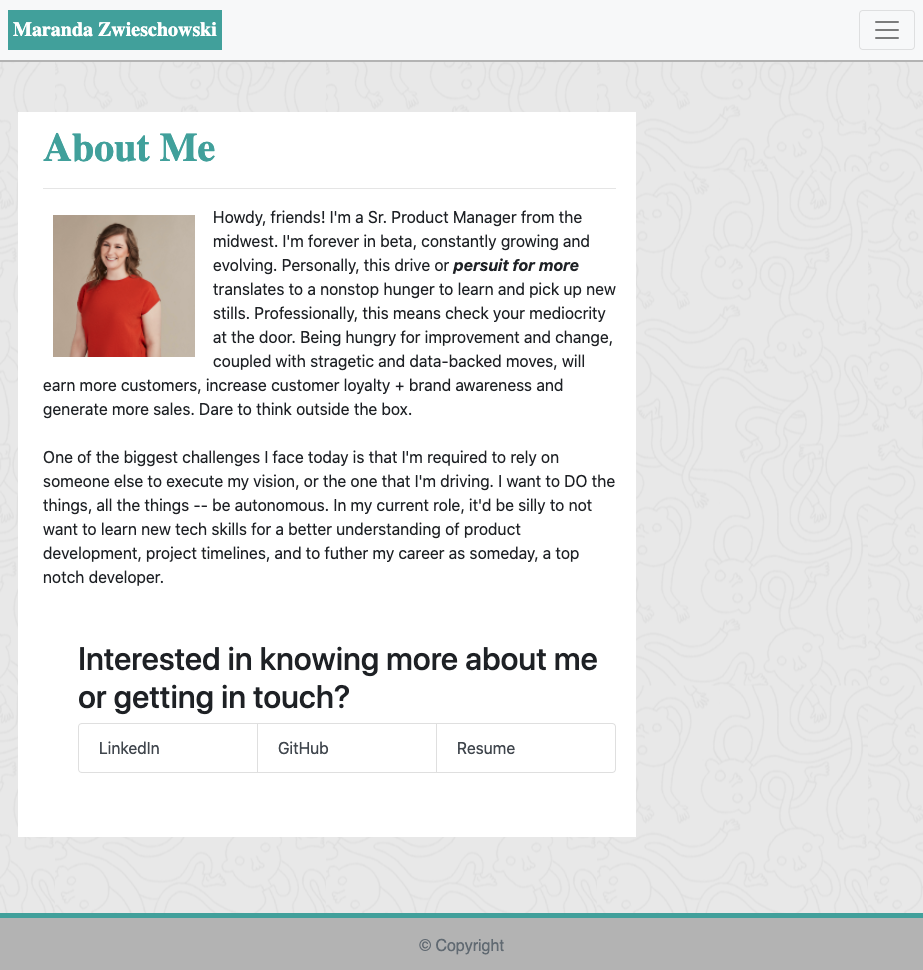
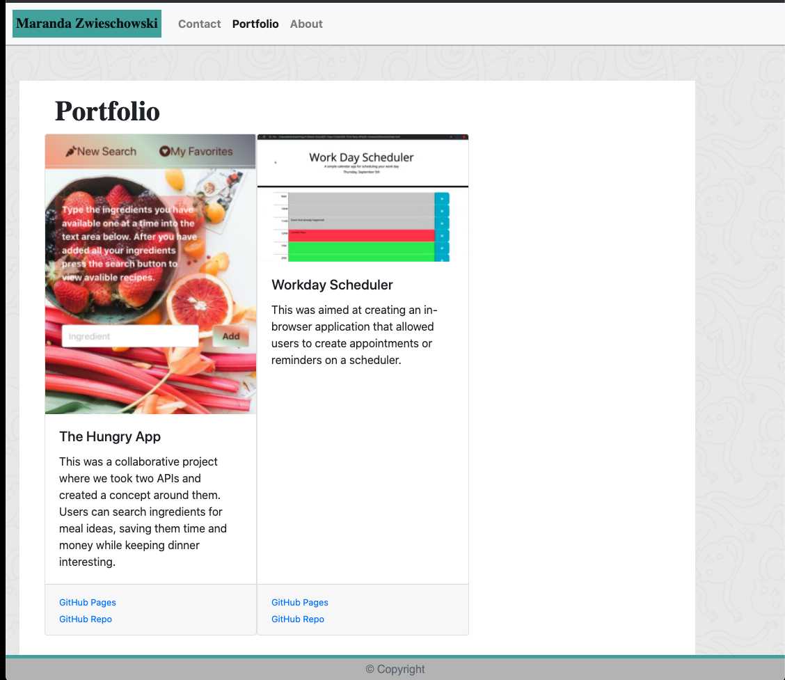

# portfolio-2
<br />
<p align="center">
  <a href="https://github.com/marandaz/portfolio-2">
    
  </a>

  <h3 align="center">Maranda Rochelle's Portfolio</h3>

  <p align="center">
    A cursory intro into my skills and portfolio. 
    <br />
    <br />
    <a href="https://github.com/marandaz/portfolio-2"><strong>Explore the docs »</strong></a>
    <br />
    <br />
    <a href="https://github.com/marandaz/portfolio-2/issues">Report Bug</a>
    ·
    <a href="https://github.com/marandaz/portfolio-2/issues">Request Feature</a>
  </p>
</p>


## Table of Contents

* [About the Project](#about-the-project)
  * [Built With](#built-with)
* [Getting Started](#getting-started)
  * [Installation](#installation)
* [Usage](#usage)
* [Roadmap](#roadmap)
* [Contributing](#contributing)
* [License](#license)
* [Contact](#contact)
* [Acknowledgements](#acknowledgements)


## About The Project

<p align="center">
<a href="https://marandaz.github.io/portfolio-2/">
    
    .
    

</a>
</p>

<!-- INSERT DESCRIPTION OF PROJECET; WHAT IS IT, WHAT'S IT'S PURPOSE -->


### Built With

* HTML
* CSS
* Bootstrap

## Getting Started

To get a local copy up and running follow these simple steps.


### Installation

1. Clone the repo
```sh
git clone git@github.com:marandaz/portfolio-2.git 
```


## Usage

This app can be used for:
* Anyone looking for inspiration for dinner; let's get you out of that rut!
* To mitigate food waste. Not sure what to do with that wrinkly pepper? Toss it in the search! 
* lazy days! Don't want to run out to the store? Let's whip something up with what you have!

## Roadmap

See the [open issues](https://github.com/marandaz/portfolio-2/issues) for a list of proposed features (and known issues).

## Contributing

Contributions are what make the open source community such an amazing place to be learn, inspire, and create. Any contributions you make are **greatly appreciated**.

1. Fork the Project
2. Create your Feature Branch (`git checkout -b feature/AmazingFeature`)
3. Commit your Changes (`git commit -m 'Add some AmazingFeature'`)
4. Push to the Branch (`git push origin feature/AmazingFeature`)
5. Open a Pull Request


## License

Copyright 2020 Maranda Zwieschowski

Permission is hereby granted, free of charge, to any person obtaining a copy of this software and associated documentation files (the "Software"), to deal in the Software without restriction, including without limitation the rights to use, copy, modify, merge, publish, distribute, sublicense, and/or sell copies of the Software, and to permit persons to whom the Software is furnished to do so, subject to the following conditions:

The above copyright notice and this permission notice shall be included in all copies or substantial portions of the Software.

THE SOFTWARE IS PROVIDED "AS IS", WITHOUT WARRANTY OF ANY KIND, EXPRESS OR IMPLIED, INCLUDING BUT NOT LIMITED TO THE WARRANTIES OF MERCHANTABILITY, FITNESS FOR A PARTICULAR PURPOSE AND NONINFRINGEMENT. IN NO EVENT SHALL THE AUTHORS OR COPYRIGHT HOLDERS BE LIABLE FOR ANY CLAIM, DAMAGES OR OTHER LIABILITY, WHETHER IN AN ACTION OF CONTRACT, TORT OR OTHERWISE, ARISING FROM, OUT OF OR IN CONNECTION WITH THE SOFTWARE OR THE USE OR OTHER DEALINGS IN THE SOFTWARE.


## Contact

Maranda Zwieschowski
<!-- * mrzwies@gmail.com -->
<!-- * phone available upon request. -->


Project Link: [https://marandaz.github.io/portfolio-2/](https://marandaz.github.io/portfolio-2/)


## Acknowledgements

* **Instructors:** Shout out to our Bootcamp instructor, John Young, for helping pave the path to a brighter future.  
<!-- ADD ADDITIONAL ACKNOLEDMENTS FOR TUTORS OR TAS THAT HAVE HELPED -->
<br>
* [NAME OF RESOURCE USED]: LINK TO RESOURCE USED
<!-- UPDATE THIS ^^ TO INLCUDE MATERIAL.IO DOCS -->


[contributors-shield]: https://img.shields.io/github/contributors/othneildrew/Best-README-Template.svg?style=flat-square
[contributors-url]: https://github.com/othneildrew/Best-README-Template/graphs/contributors
[forks-shield]: https://img.shields.io/github/forks/othneildrew/Best-README-Template.svg?style=flat-square
[forks-url]: https://github.com/othneildrew/Best-README-Template/network/members
[stars-shield]: https://img.shields.io/github/stars/othneildrew/Best-README-Template.svg?style=flat-square
[stars-url]: https://github.com/othneildrew/Best-README-Template/stargazers
[issues-shield]: https://img.shields.io/github/issues/othneildrew/Best-README-Template.svg?style=flat-square
[issues-url]: https://github.com/othneildrew/Best-README-Template/issues
[license-shield]: https://img.shields.io/github/license/othneildrew/Best-README-Template.svg?style=flat-square
[license-url]: https://github.com/othneildrew/Best-README-Template/blob/master/LICENSE.txt
[linkedin-shield]: https://img.shields.io/badge/-LinkedIn-black.svg?style=flat-square&logo=linkedin&colorB=555
[linkedin-url]: https://linkedin.com/in/othneildrew
[product-screenshot]: images/screenshot.png